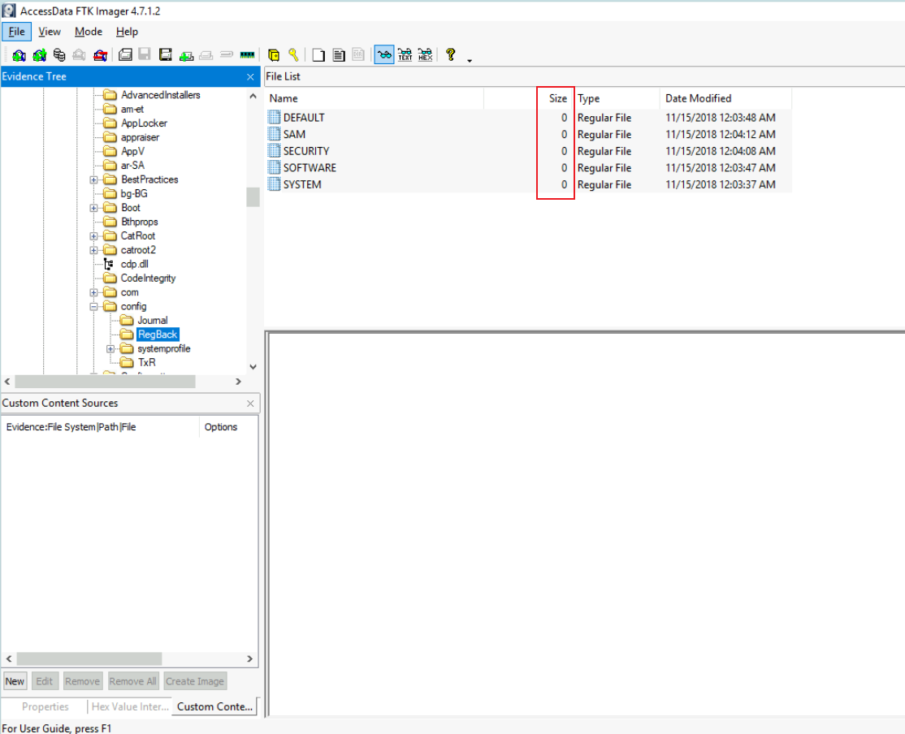

## 初始信息

```bash
memdump.mem  pagefile.sys disk.dd
```

## 使用 volatility3 分析内存

### 查看系统信息

```bash
python3 vol.py -f memdump.mem windows.info
Kernel Base	0xf802388a7000
DTB	0x1aa000
Symbols	file:///home/ubuntu/Desktop/volatility3/volatility3/symbols/windows/ntkrnlmp.pdb/94E2AE6323B686F1F4B25BA580582E04-1.json.xz
Is64Bit	True
IsPAE	False
layer_name	0 WindowsIntel32e
memory_layer	1 FileLayer
KdVersionBlock	0xf80238ca4f08
Major/Minor	15.17763
MachineType	34404
KeNumberProcessors	2
SystemTime	2024-05-14 22:07:36
NtSystemRoot	C:\Windows
NtProductType	NtProductServer
NtMajorVersion	10
NtMinorVersion	0
PE MajorOperatingSystemVersion	10
PE MinorOperatingSystemVersion	0
PE Machine	34404
PE TimeDateStamp	Sat May  4 18:48:48 2030
```

### 查看进程信息

```bash
python3 vol.py -f memdump.mem windows.pslist >> pslist.txt
```


正常情况下`svhost.exe`会存在多个实例，且均指向`services.exe`，其中`804`是`services.exe`的`PID`，但是`1036`却是`powershell.exe`的`PID`，显然这个进程存在问题

### 查看创建进程的命令行

```bash
python3 vol.py -f memdump.mem windows.cmdline
```


`svchost.exe` 的文件路径并不是默认的 `C:\Windows\System32\svchost.exe`，而是位于 `C:\Tools\` 目录下

很明显这是伪装成系统进程的恶意程序，用于与外部IP地址进行通信。

## 使用 FTK Imager 分析磁盘

### 定位恶意文件

查看从内存中找到的文件`C:\Tools\svchost.exe`


没有其他信息了，尝试从注册表中收集信息



导出`C:\Windows\System32\config`下的注册表文件

导出用户目录`C:\Users\Bobby\NTUSER.DAT`

导入`Registry Explorer`

因为搜索`svhost.exe`由`AutoConnector`创建，所以尝试在注册表中进行搜索`AutoConnector`


成功定位`AutoConnecter`的位置

### 分析系统日志

从`C:\Windows\System32\winevt\Logs\s`导出事件日志

因为运行的脚本是Powershell脚本，所以仅导入包含Powershell关键字的日志到`EventViewer`即可

但未搜索到与`connector.ps1`相关的日志。

------

*未完待续*
