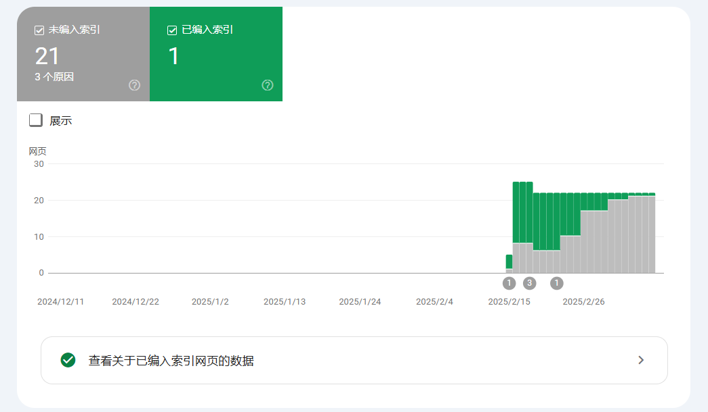
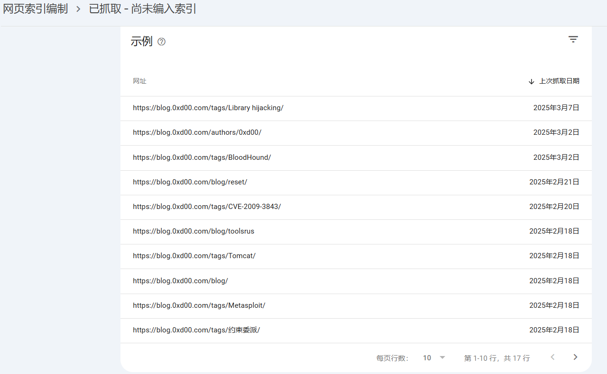

# 解决Google索引异常问题

## 问题发现

今天尝试在Google上搜索我的文章，发现竟然一条也搜不到（使用site:网址语法）。这非常不对劲，因为之前直接通过文章关键字搜索都能在搜索结果前排显示。于是我登录Google Search Console查看了一下索引情况。





通过阅读Google提供的文档，我发现以下两段描述非常符合我的情况：

> Your goal is to get the *canonical* version of every important page indexed. *Duplicate* or *alternate* pages shouldn't be indexed. Having a page marked duplicate or alternate is usually a *good* thing; it means that we've found the canonical page and indexed it. You can find the canonical for any URL by running the URL Inspection tool.

> Duplicate without user-selected canonical: This page is a duplicate of another page, although it doesn't indicate a preferred canonical page. Google has chosen the other page as the canonical for this page, and so will not serve this page in Search. You can Inspect this URL to see which URL Google considers canonical for this page.

## 问题分析

分析后发现，我的博客存在严重的内容重复问题：
- 首页展示了文章列表
- 博客页面(/blog/)也展示了相同的文章列表
- 标签页面(/tags/xxx/)同样展示了部分相同的文章

这导致Google认为这些页面是重复内容，从而只索引了它认为是"规范版本"的页面，其他页面则被标记为重复而未被索引。

## 解决方案

### 1. 差异化页面内容

这种做法需要大量修改页面代码。为了快速解决问题，我选择了通过最小化改动来解决，即后面的两个方案

### 2. 禁止爬取特定目录

在`robots.txt`中添加以下规则，禁止爬虫访问标签的子目录：

```
User-agent: *
Allow: /
Allow: /tags$
Disallow: /tags/
```

这样可以允许爬虫访问标签主页，但禁止访问具体的标签页面，减少重复内容。

### 3. 为页面添加canonical标签

canonical标签是告诉搜索引擎哪个URL是首选版本的有效方法。

为博客文章列表页添加：

```astro
// 第一页的canonical应指向博客主页
const canonicalUrl = page.currentPage === 1
  ? new URL('/blog', Astro.site).toString()
  : undefined; // 其他分页可以不设置，使用当前URL
```

对于其他页面：

```astro
const { title, description, image, canonicalUrl } = Astro.props
<link rel="canonical" href={canonicalUrl || currentUrl} />
```

通过这种实现，我告诉Google：
- 分页页面的首选版本是第一页
- 标签页面的首选版本是对应的文章页面

## 效果验证

实施上述更改后，需要等待Google Search Console更新数据。预计在几天到几周内，爬虫会重新爬取网站并应用新的规则。

## 总结经验

1. **内容重复问题严重影响SEO**：即使是功能正常的网站，如果存在大量重复内容，也会导致索引问题
2. **canonical标签的重要性**：明确指定首选URL可以帮助搜索引擎正确索引内容
3. **robots.txt的合理使用**：有选择地禁止爬取某些页面可以减少重复内容问题
4. **持续监控索引状态**：Google Search Console是发现和解决索引问题的重要工具

我将继续监控网站的索引情况，并在必要时进一步优化。分享此经验希望能帮助遇到类似问题的开发者。